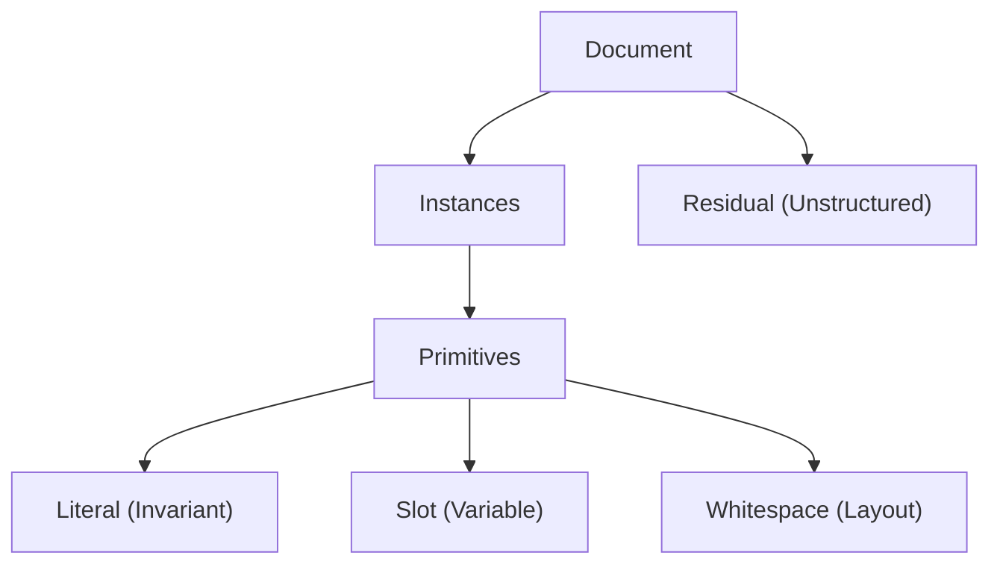

# Foundations

The premises and objectives Wring is built on — the "why it is shaped this way"
behind the mechanics in [`ARCHITECTURE.md`](../../ARCHITECTURE.md).

This is the conceptual layer. Related docs in this folder:
[`Intuition.md`](Intuition.md) (first-principles observations about template
structure), [`Terms.md`](Terms.md) (vocabulary), and [`Order.md`](Order.md)
(quantifying ordered relationships and the decoy problem). The two non-negotiable
properties of any output — **Character Allocation** and **Reconstruction Fidelity** —
are stated as invariants in [`ARCHITECTURE.md` § Key Invariants](../../ARCHITECTURE.md#key-invariants)
and are not repeated here.

## The model

Given one document, infer a compact set of recurring patterns (templates) and a map
of where their instances occur, optimizing for a balance of compression and human
interpretability.

Every character is allocated to one of three primitive types, or else to residual:

Treating **Whitespace** as a primitive distinct from Literal is a design goal, not a
current capability: it would let the system optionally expunge "formatting noise" for
readability, trading exact reproduction for legibility. Today's implementations carry
slots and literals; the whitespace split is not yet exposed.

## Objectives

Beyond the two invariants (Character Allocation, Reconstruction Fidelity):

- **Structural Separation** — the central objective. Decompose the document into
  recurring structural patterns (templates) and their specific occurrences
  (instances), separating boilerplate from variable content. Prioritize
  interpretability over maximal compression.
- **Browser-First Performance** *(planned)* — discovery and indexing aimed at browser
  memory and execution limits (roughly the 100 KB–10 MB range), with WASM for
  high-density indexing where necessary. Aspirational: there is no WASM in the repo
  today; the current scripts are plain Node/ES modules.

## Key Assumptions

- **Templates are Grounded in Repeats** — templates link repeated substrings. Starting
  from repeated substrings, we can reach any template.
- **The "DRY" Objective** — the goal is to "dry up" a document, making the underlying
  data more intelligible by removing redundant text.
- **Structural vs. Floating Repeats** — some repeats are foundational, tied to document
  architecture; others are floating or transversal. What constitutes structure is
  assessed from a perspective. *(Originally Wring discriminated these by gap-variance —
  low variance in relative distance suggests structural, high variance suggests
  incidental. That statistical mechanism has been largely superseded by the structural
  approach of Bookend Merge; it survives as a possible ranking signal. See
  [`Order.md`](Order.md) and [`ARCHITECTURE.md` § The Decoy Problem](../../ARCHITECTURE.md#the-decoy-problem).)*
- **Idealized Forms** — a template should bind to a meaningful structure. This may mean
  gravitating toward instances that support a coherent model and away from instances
  that pollute it.
- **Flat or Hierarchical** — instances may cover disjoint regions (flat model, simple
  interval scheduling) or form a parse DAG where templates contain other templates
  (hierarchical model — captures nesting but requires a defined decoding order). Either
  may be of interest depending on the document.
- **Navigable Discovery** — discovery may benefit from a human in the loop. The
  algorithm proposes potential structures; the user navigates and selects the
  abstractions that are most meaningful.
