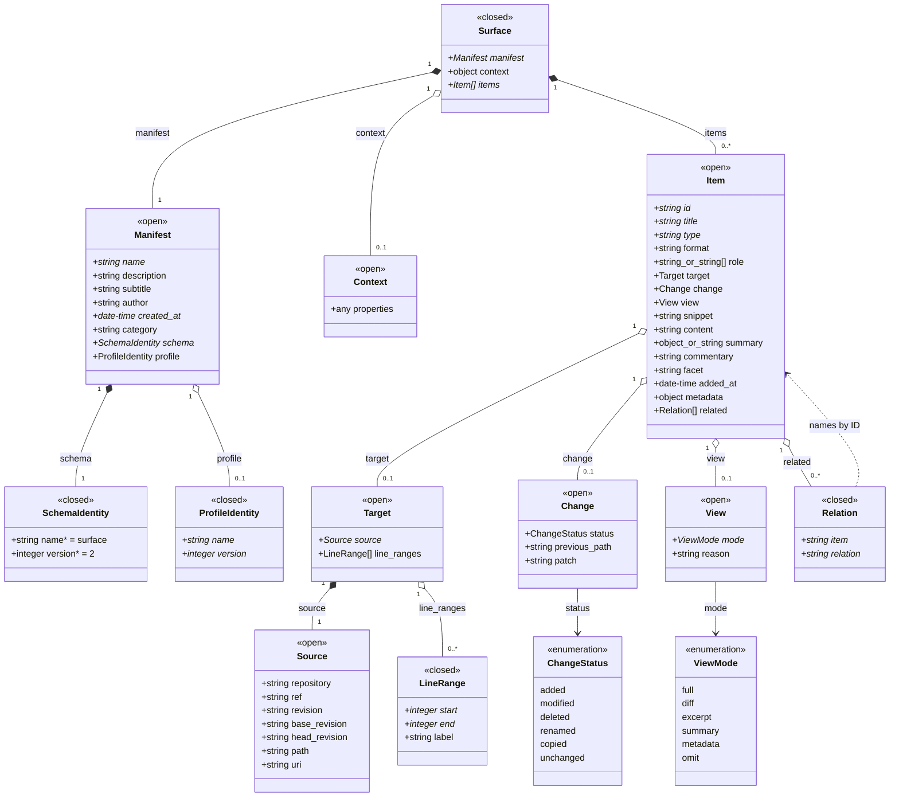

# The surface format

A **surface** is a JSON file: a curated, annotated set of items presented for a reason at a moment. Files stay where they live (a repo, a URL, a local disk); the surface layers selection, arrangement, and commentary over them, and is archivable as a unit when its moment passes. The format originated in the Surfacer desktop app (the home repo, `projects/surfacer/`) and is also read and written by show-repo's estate view; this document is the written contract between every implementation.

**Authoritative artifacts:** the JSON Schemas beside this doc are the validation source of truth; this document carries the concepts, conventions, and worked examples.

- [`schemas/surface-v2.schema.json`](schemas/surface-v2.schema.json): the core schema.
- [`schemas/profiles/branch-review-v1.schema.json`](schemas/profiles/branch-review-v1.schema.json): the first profile.

**Status (2026-07-20):** this contract defines **v2**. Both existing readers (the Surfacer C# app and `lib/alpineComponents/estate.js`) still read v1; their migration targets are documented at the end of this file and are deliberately not part of this pass. New surfaces should be authored as v2 once a reader exists; v1 files remain valid v1.

## Shape

```
surface (.surface, JSON)
├── manifest            identity and placement
│   ├── name*  description  subtitle  author  created_at*  category
│   ├── schema*           { name: "surface", version: 2 }
│   └── profile           { name, version }        (optional)
├── context             open block, defined by the active profile
└── items[]
    ├── id*  title*  type*  format
    ├── role            semantic role in the surface (optional in core)
    ├── target          { source { repository | uri | path, ref, revision, … }, line_ranges[] }
    ├── change          { status, previous_path, patch }
    ├── view            { mode*, reason }          (optional in core)
    ├── snippet  content  summary  commentary  facet  added_at
    ├── metadata
    └── related[]       { item, relation }
```

`*` marks required. Objects are open (additional properties allowed) unless the schema closes them (`schema`/`profile` identity, `line_ranges` entries, `related` entries).

## Diagram



## The annotation fields, disambiguated

Four fields sound alike and carry distinct meanings:

| Field | Answers |
|---|---|
| `summary` | What does the item say, shorter? (condenses the item) |
| `commentary` | What does the curator think about it? (interprets the item) |
| `view.reason` | Why was this representation chosen? (justifies the view mode) |
| `facet` | Where does it sit in the rendered grouping? (renderer-visible section key) |

`facet` stays first-class rather than moving into `metadata` because renderers dispatch on it (it drives sidebar structure in the Surfacer app).

## Source convention

A `source` says where the targeted resource lives. Three forms, by which fields are present:

1. **Repository source:** the structured `{repository, ref, path}` triple, `repository` as `owner/repo`, always explicit. This is preferred over any packed URI grammar: it round-trips losslessly (it is the stage's item shape) and avoids escaping ambiguity around slashes, colons, and `@` in refs and paths. `ref` is symbolic (branch or tag; absent means the default branch); `revision` pins the resolved commit at capture time. `base_revision`/`head_revision` express a per-source compare for mixed-repository cases.
2. **External source:** `uri`, for resources that already have a canonical external URI (a web page, an API endpoint). Do not encode repository references as URIs.
3. **Local source:** `path` with no `repository`. **A path-only source is local to the environment rendering the surface** (the machine running the Surfacer app). It is never resolved against a repository established elsewhere; repository sources always name their repository. This is also the portability boundary: repository and external sources travel with the surface, local sources are machine-bound.

## View semantics

`view` is the item's representation instruction: `mode` one of `full`, `diff`, `excerpt`, `summary`, `metadata`, `omit`, with `reason` saying why. Two rules:

- **Absence is not `full`.** An item with no `view` supplies no instruction; the active profile or the renderer applies its normal treatment. `full` is an affirmative request and would surprise on a bookmark or an external link.
- Excerpts follow `target.line_ranges` (named, labeled ranges), never arbitrary truncation.

## Profiles

The core schema is deliberately light: `role`, `view`, and `context` are optional and open, so a casual shelf surface (bookmarks, a curated reading list) carries no ceremony. A **profile** is a named, versioned constraint layer for a specific use, declared in the manifest beside the schema identity:

```json
"schema":  { "name": "surface", "version": 2 },
"profile": { "name": "branch-review", "version": 1 }
```

A document claiming a profile must validate against **both** the core schema and the profile schema. The core leaves `context` open; the profile defines and requires its fields, and may raise optional core fields (`role`, `view`) to required. Profile schemas live in [`schemas/profiles/`](schemas/profiles/), one file per profile version.

### `branch-review/1`

Serializes a review package: a base/head compare plus a role-annotated selection. The insight it encodes: the unified diff is the authoritative change record, and a surface is the **manifest layer** over it (what was included, at what view, why, and what was omitted), not the content carrier. Shipping the package to a token-less reader is a separate **materialization** step: resolve each ref through a token, cut excerpts at the declared ranges, inline the patch, and emit one self-describing text bundle. The surface stays durable and inspectable; the bundle is the disposable transport.

The profile requires `context.repository`, `context.base`, and `context.head` (each endpoint a `{ref, revision}`; pin the revision, refs move), plus `role` and `view` on every item; items with `role: "changed"` must carry `change.status`. Documented roles: `intent`, `changed`, `context`, `omitted`.

Worked example:

```json
{
  "manifest": {
    "name": "Review: stage rework",
    "description": "Review package for the stage-to-estate move.",
    "author": "Claude",
    "created_at": "2026-07-20T18:00:00Z",
    "category": "showcase",
    "schema": { "name": "surface", "version": 2 },
    "profile": { "name": "branch-review", "version": 1 }
  },
  "context": {
    "repository": "mehrlander/web-tools",
    "base": { "ref": "main", "revision": "70ddd99" },
    "head": { "ref": "claude/stage-rework-x1y2z3", "revision": "a81c3f2" },
    "intent": "Move the stage to the estate context without changing the deposit flow.",
    "review_focus": ["correctness", "hidden coupling"]
  },
  "items": [
    {
      "id": "request",
      "title": "Review request",
      "type": "story",
      "role": "intent",
      "view": { "mode": "full" },
      "format": "markdown",
      "content": "Look particularly for accidental semantic changes in the deposit flow."
    },
    {
      "id": "stage-js",
      "title": "lib/alpineComponents/stage.js",
      "type": "file",
      "role": "changed",
      "target": {
        "source": {
          "repository": "mehrlander/web-tools",
          "ref": "claude/stage-rework-x1y2z3",
          "revision": "a81c3f2",
          "path": "lib/alpineComponents/stage.js"
        }
      },
      "change": { "status": "modified" },
      "view": { "mode": "full", "reason": "central abstraction, changed in several distant regions" }
    },
    {
      "id": "shell",
      "title": "pages/show-repo/show-repo.html",
      "type": "file",
      "role": "context",
      "target": {
        "source": {
          "repository": "mehrlander/web-tools",
          "ref": "claude/stage-rework-x1y2z3",
          "revision": "a81c3f2",
          "path": "pages/show-repo/show-repo.html"
        },
        "line_ranges": [ { "start": 40, "end": 115, "label": "stage mount" } ]
      },
      "view": { "mode": "excerpt", "reason": "only the mount region bears on the change" }
    },
    {
      "id": "thumb",
      "title": "pages/thumbs/show-repo.png",
      "type": "file",
      "role": "omitted",
      "change": { "status": "modified" },
      "view": { "mode": "metadata", "reason": "regenerated screenshot; not reviewable content" }
    }
  ]
}
```

## v1 → v2 migration

v1 is the shape the Surfacer app shipped with (`schema_version: 1` in the manifest; see the examples in home `projects/surfacer/app/surfaces.example/`). The move to v2 is a semantic split, not a field-for-field rename: v1's `kind` mixed genre with transport (`github_blob` says both "a file" and "lives on GitHub"), and v2 separates them into `type` (genre) and `target.source` (location).

| v1 | v2 |
|---|---|
| `manifest.schema_version: 1` | `manifest.schema: { name: "surface", version: 2 }` |
| `manifest.created` | `manifest.created_at` |
| `kind: note` / `kind: story` | `type: note` / `type: story` (`body` → `content`, with `format`) |
| `kind: github_blob` / `github_dir` / `repo` | `type: file` / `directory` / `repo` + `target.source {repository, ref, path}` |
| `kind: url` | `type: link` + `target.source.uri` |
| `kind: local_html` / `local_md` / `local_text` / `image` | `type: file` + path-only `target.source` (local), `format` as needed |
| app-generated kinds (`recent`, `downloads`, `chron_thread`, `system_health`, `script`) | app-defined `type` values, unchanged in meaning; open by design |
| flat per-kind source fields on the item | `target.source` |
| `commentary`, `facet`, `added_at`, `snippet`, `related` | retained as-is (`related` entries become `{item, relation}`) |
| (no equivalent) | `role`, `view`, `change`, `context`, `profile` |

### Reader migration targets (documented now, changed later)

Deliberately out of scope for the pass that lands this contract; change the implementations only after the contract has been reviewed.

- **Surfacer C# app + `surfacer.html`** (home `projects/surfacer/app/`): reads v1. Target: dispatch on `manifest.schema`; keep reading v1 files indefinitely (personal surfaces are not migrated in place), author new surfaces as v2.
- **`lib/alpineComponents/estate.js`** (show-repo's Surfaces estate view): reads v1 (`kind`, flat fields) from the registry repo's `surfaces/`. Target: same dual-read dispatch; the editor template seeds v2. The stage convergence work (tracker: "Converge the stage and surface item schemas") builds on the v2 item shape, so estate.js migrates as part of, or just ahead of, that task.
