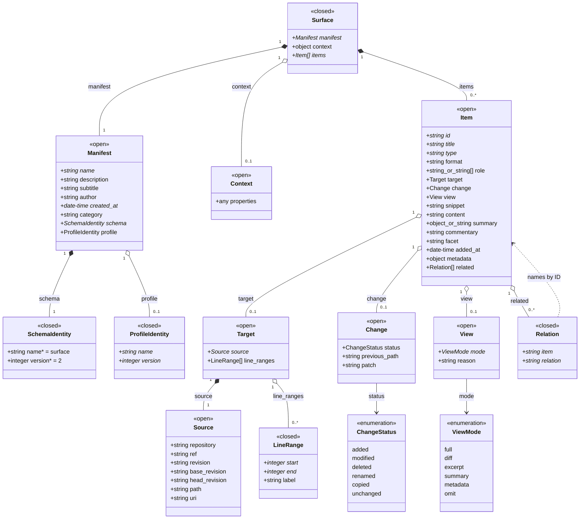

# The surface format

A **surface** is a JSON file: a curated, annotated set of items presented for a reason at a moment. Files stay where they live (a repo, a URL, a local disk); the surface layers selection, arrangement, and commentary over them, and is archivable as a unit when its moment passes. The format originated in the Surfacer desktop app (the home repo, `projects/surfacer/`) and is also read and written by show-repo's estate view; this document is the written contract between every implementation.

**Authoritative artifacts:** the JSON Schemas beside this doc are the validation source of truth; this document carries the concepts, conventions, and worked examples.

> [!WARNING]
> **Stale 2026-08-05 (nothing validates against them):** "source of truth" states
> the intent, not the practice. As of this date no code in `lib/`, `pages/`, or
> the skills loads these schemas, and nothing validates a surface document
> against them, so a producer that drifts from the schema gets no signal. They
> are a written contract two readers can agree on, which is worth having; they
> are not a gate. Found by the docs registry's reach pass, which is what made
> the gap visible: they are the only files in `docs/` declared authoritative
> that nothing reads.

- [`schemas/surface-v2.schema.json`](schemas/surface-v2.schema.json): the core schema.
- [`schemas/profiles/branch-review-v1.schema.json`](schemas/profiles/branch-review-v1.schema.json): the first profile.

**Status (2026-08-03):** this contract defines **v2**, and a v2 reader now exists. [`lib/kits/surface.js`](../../lib/kits/surface.js) dual-reads v1 and v2, normalizing to v2 in memory; show-repo's Surfaces shelf and its Stage both read through it, and new surfaces are authored as v2 under the [`stage/1`](#stage1) profile. The Surfacer C# app still reads v1 and its migration target stands at the end of this file. **v1 files are never rewritten in place:** reading normalizes for display only, so a v1 file stays v1 until someone deliberately saves it as v2.

## Shape

```
surface (.surface, JSON)
├── manifest            identity and placement
│   ├── name*  description  subtitle  author  created_at*  category
│   ├── schema*           { name: "surface", version: 2 }
│   └── profile           { name, version }        (optional)
├── context             open block, defined by the active profile
└── items[]
    ├── id*  title*  type*  format
    ├── role            semantic role in the surface (optional in core)
    ├── target          { source { repository | uri | path, ref, revision, … }, line_ranges[] }
    ├── change          { status, previous_path, patch }
    ├── view            { mode*, reason }          (optional in core)
    ├── snippet  content  summary  commentary  facet  added_at
    ├── metadata
    └── related[]       { item, relation }
```

`*` marks required. Objects are open (additional properties allowed) unless the schema closes them (`schema`/`profile` identity, `line_ranges` entries, `related` entries).

## Diagram


```mermaid
classDiagram
direction TB

class Surface {
  <<closed>>
  +Manifest manifest*
  +object context
  +Item[] items*
}

class Manifest {
  <<open>>
  +string name*
  +string description
  +string subtitle
  +string author
  +date-time created_at*
  +string category
  +SchemaIdentity schema*
  +ProfileIdentity profile
}

class SchemaIdentity {
  <<closed>>
  +string name* = surface
  +integer version* = 2
}

class Context {
  <<open>>
  +any properties
}

class ProfileIdentity {
  <<closed>>
  +string name*
  +integer version*
}

class Item {
  <<open>>
  +string id*
  +string title*
  +string type*
  +string format
  +string_or_string[] role
  +Target target
  +Change change
  +View view
  +string snippet
  +string content
  +object_or_string summary
  +string commentary
  +string facet
  +date-time added_at
  +object metadata
  +Relation[] related
}

class Target {
  <<open>>
  +Source source*
  +LineRange[] line_ranges
}

class Source {
  <<open>>
  +string repository
  +string ref
  +string revision
  +string base_revision
  +string head_revision
  +string path
  +string uri
}

class LineRange {
  <<closed>>
  +integer start*
  +integer end*
  +string label
}

class Change {
  <<open>>
  +ChangeStatus status
  +string previous_path
  +string patch
}

class ChangeStatus {
  <<enumeration>>
  added
  modified
  deleted
  renamed
  copied
  unchanged
}

class View {
  <<open>>
  +ViewMode mode*
  +string reason
}

class ViewMode {
  <<enumeration>>
  full
  diff
  excerpt
  summary
  metadata
  omit
}

class Relation {
  <<closed>>
  +string item*
  +string relation*
}

Surface "1" *-- "1" Manifest : manifest
Surface "1" o-- "0..1" Context : context
Surface "1" *-- "0..*" Item : items
Manifest "1" *-- "1" SchemaIdentity : schema
Manifest "1" o-- "0..1" ProfileIdentity : profile
Item "1" o-- "0..1" Target : target
Target "1" *-- "1" Source : source
Target "1" o-- "0..*" LineRange : line_ranges
Item "1" o-- "0..1" Change : change
Change --> ChangeStatus : status
Item "1" o-- "0..1" View : view
View --> ViewMode : mode
Item "1" o-- "0..*" Relation : related
Relation ..> Item : names by ID
```

## The annotation fields, disambiguated

Four fields sound alike and carry distinct meanings:

| Field | Answers |
|---|---|
| `summary` | What does the item say, shorter? (condenses the item) |
| `commentary` | What does the curator think about it? (interprets the item) |
| `view.reason` | Why was this representation chosen? (justifies the view mode) |
| `facet` | Where does it sit in the rendered grouping? (renderer-visible section key) |

`facet` stays first-class rather than moving into `metadata` because renderers dispatch on it (it drives sidebar structure in the Surfacer app).

## Source convention

A `source` says where the targeted resource lives. Three forms, by which fields are present:

1. **Repository source:** the structured `{repository, ref, path}` triple, `repository` as `owner/repo`, always explicit. This is preferred over any packed URI grammar: it round-trips losslessly (it is the stage's item shape) and avoids escaping ambiguity around slashes, colons, and `@` in refs and paths. `ref` is symbolic (branch or tag; absent means the default branch); `revision` pins the resolved commit at capture time. `base_revision`/`head_revision` express a per-source compare for mixed-repository cases.
2. **External source:** `uri`, for resources that already have a canonical external URI (a web page, an API endpoint). Do not encode repository references as URIs.
3. **Local source:** `path` with no `repository`. **A path-only source is local to the environment rendering the surface** (the machine running the Surfacer app). It is never resolved against a repository established elsewhere; repository sources always name their repository. This is also the portability boundary: repository and external sources travel with the surface, local sources are machine-bound.

## View semantics

`view` is the item's representation instruction: `mode` one of `full`, `diff`, `excerpt`, `summary`, `metadata`, `omit`, with `reason` saying why. Two rules:

- **Absence is not `full`.** An item with no `view` supplies no instruction; the active profile or the renderer applies its normal treatment. `full` is an affirmative request and would surprise on a bookmark or an external link.
- Excerpts follow `target.line_ranges` (named, labeled ranges), never arbitrary truncation.

## Profiles

The core schema is deliberately light: `role`, `view`, and `context` are optional and open, so a casual shelf surface (bookmarks, a curated reading list) carries no ceremony. A **profile** is a named, versioned constraint layer for a specific use, declared in the manifest beside the schema identity:

```json
"schema":  { "name": "surface", "version": 2 },
"profile": { "name": "branch-review", "version": 1 }
```

A document claiming a profile must validate against **both** the core schema and the profile schema. The core leaves `context` open; the profile defines and requires its fields, and may raise optional core fields (`role`, `view`) to required. Profile schemas live in [`schemas/profiles/`](schemas/profiles/), one file per profile version.

### `branch-review/1`

Serializes a review package: a base/head compare plus a role-annotated selection. The insight it encodes: the unified diff is the authoritative change record, and a surface is the **manifest layer** over it (what was included, at what view, why, and what was omitted), not the content carrier. Shipping the package to a token-less reader is a separate **materialization** step: resolve each ref through a token, cut excerpts at the declared ranges, inline the patch, and emit one self-describing text bundle. The surface stays durable and inspectable; the bundle is the disposable transport.

The profile requires `context.repository`, `context.base`, and `context.head` (each endpoint a `{ref, revision}`; pin the revision, refs move), plus `role` and `view` on every item; items with `role: "changed"` must carry `change.status`. Documented roles: `intent`, `changed`, `context`, `omitted`.

Worked example:

```json
{
  "manifest": {
    "name": "Review: stage rework",
    "description": "Review package for the stage-to-estate move.",
    "author": "Claude",
    "created_at": "2026-07-20T18:00:00Z",
    "category": "showcase",
    "schema": { "name": "surface", "version": 2 },
    "profile": { "name": "branch-review", "version": 1 }
  },
  "context": {
    "repository": "mehrlander/web-tools",
    "base": { "ref": "main", "revision": "70ddd99" },
    "head": { "ref": "claude/stage-rework-x1y2z3", "revision": "a81c3f2" },
    "intent": "Move the stage to the estate context without changing the deposit flow.",
    "review_focus": ["correctness", "hidden coupling"]
  },
  "items": [
    {
      "id": "request",
      "title": "Review request",
      "type": "story",
      "role": "intent",
      "view": { "mode": "full" },
      "format": "markdown",
      "content": "Look particularly for accidental semantic changes in the deposit flow."
    },
    {
      "id": "stage-js",
      "title": "lib/alpineComponents/stage.js",
      "type": "file",
      "role": "changed",
      "target": {
        "source": {
          "repository": "mehrlander/web-tools",
          "ref": "claude/stage-rework-x1y2z3",
          "revision": "a81c3f2",
          "path": "lib/alpineComponents/stage.js"
        }
      },
      "change": { "status": "modified" },
      "view": { "mode": "full", "reason": "central abstraction, changed in several distant regions" }
    },
    {
      "id": "shell",
      "title": "pages/show-repo/show-repo.html",
      "type": "file",
      "role": "context",
      "target": {
        "source": {
          "repository": "mehrlander/web-tools",
          "ref": "claude/stage-rework-x1y2z3",
          "revision": "a81c3f2",
          "path": "pages/show-repo/show-repo.html"
        },
        "line_ranges": [ { "start": 40, "end": 115, "label": "stage mount" } ]
      },
      "view": { "mode": "excerpt", "reason": "only the mount region bears on the change" }
    },
    {
      "id": "thumb",
      "title": "pages/thumbs/show-repo.png",
      "type": "file",
      "role": "omitted",
      "change": { "status": "modified" },
      "view": { "mode": "metadata", "reason": "regenerated screenshot; not reviewable content" }
    }
  ]
}
```

### `stage/1`

Serializes a **staged fileset**: a working set of files gathered for an operation, saved so it survives the session. The insight it encodes is the inverse of branch-review's. There, a surface is the manifest layer over a diff that is the real record; here, the set itself is the record, and the operations that motivated it (bundle, send, download) are the tool's business and stay out.

The profile requires exactly one thing: **every item carries a `target`**. A stage is a set of things, not a piece of writing about them, and that single constraint is what the profile is for. `context` may carry a `destination` (`owner/repo[:dir]`, where the set is proposed to go) and `prompts` (authored review asks, `{label, ask}`). Documented relation: `compares-to`, naming the other side of a diff pair.

The line that decides what may enter: **a field belongs if it is still true a year later with no tool running.** A proposed destination passes, since it is a claim about the set. A transfer in flight does not. Nor does the Diff lens's per-side ref override, which describes a moment of looking rather than the set, and so stays a lens control.

Three things are worth naming because they are absent on purpose:

- **No `intent` field.** branch-review has one, meaning "why the *change* exists," a fact about its subject. A stage's equivalent question is "why this set exists," which `manifest.description` already answers. A second field beside it would be two names for one thing.
- **No surface-level view mode.** The stage link's `&mode=diff` says "open on the Diff tab," which is transport, not content. What the surface records instead is `view.mode: "diff"` on the two compared items plus a `compares-to` relation between them, which says *which two*, something the flag never could.
- **No name required from the author.** `manifest.name` is generated from the contents (first file, plus a count), because a saved stage is a clipboard entry rather than a document. Renaming is one field in the editor for the ones that grow into documents.

Worked example:

```json
{
  "manifest": {
    "name": "stage.js +1",
    "description": "The two files behind the stage/surface collapse.",
    "created_at": "2026-08-03T17:20:00Z",
    "category": "stage",
    "schema": { "name": "surface", "version": 2 },
    "profile": { "name": "stage", "version": 1 }
  },
  "context": {
    "destination": "mehrlander/home:docs",
    "prompts": [
      { "label": "Fresh-eyes clarity", "ask": "Read this as someone new to the topic. Where does it lose you?" }
    ]
  },
  "items": [
    {
      "id": "mehrlander/web-tools:lib/alpineComponents/stage.js",
      "title": "lib/alpineComponents/stage.js",
      "type": "file",
      "target": { "source": { "repository": "mehrlander/web-tools", "path": "lib/alpineComponents/stage.js" } },
      "view": { "mode": "diff" },
      "related": [ { "item": "mehrlander/web-tools:lib/kits/surface.js", "relation": "compares-to" } ]
    },
    {
      "id": "mehrlander/web-tools:lib/kits/surface.js",
      "title": "lib/kits/surface.js",
      "type": "file",
      "target": { "source": { "repository": "mehrlander/web-tools", "path": "lib/kits/surface.js" } },
      "view": { "mode": "diff" }
    }
  ]
}
```

## v1 → v2 migration

v1 is the shape the Surfacer app shipped with (`schema_version: 1` in the manifest; see the examples in home `projects/surfacer/app/surfaces.example/`). The move to v2 is a semantic split, not a field-for-field rename: v1's `kind` mixed genre with transport (`github_blob` says both "a file" and "lives on GitHub"), and v2 separates them into `type` (genre) and `target.source` (location).

| v1 | v2 |
|---|---|
| `manifest.schema_version: 1` | `manifest.schema: { name: "surface", version: 2 }` |
| `manifest.created` | `manifest.created_at` |
| `kind: note` / `kind: story` | `type: note` / `type: story` (`body` → `content`, with `format`) |
| `kind: github_blob` / `github_dir` / `repo` | `type: file` / `directory` / `repo` + `target.source {repository, ref, path}` |
| `kind: url` | `type: link` + `target.source.uri` |
| `kind: local_html` / `local_md` / `local_text` / `image` | `type: file` + path-only `target.source` (local), `format` as needed |
| app-generated kinds (`recent`, `downloads`, `chron_thread`, `system_health`, `script`) | app-defined `type` values, unchanged in meaning; open by design |
| flat per-kind source fields on the item | `target.source` |
| `commentary`, `facet`, `added_at`, `snippet`, `related` | retained as-is (`related` entries become `{item, relation}`) |
| (no equivalent) | `role`, `view`, `change`, `context`, `profile` |

### Reader migration targets (documented now, changed later)

Deliberately out of scope for the pass that lands this contract; change the implementations only after the contract has been reviewed.

- **Surfacer C# app + `surfacer.html`** (home `projects/surfacer/app/`): reads v1. Target: dispatch on `manifest.schema`; keep reading v1 files indefinitely (personal surfaces are not migrated in place), author new surfaces as v2.
- **`lib/alpineComponents/estate.js`** (show-repo's Surfaces shelf): **migrated 2026-08-03.** It reads every surface through `lib/kits/surface.js`, which dual-reads and normalizes to v2, and the editor seeds v2. The stage convergence it was waiting on landed in the same pass: the Stage is now the working surface, saving mints a v2 `stage/1` file, and the two views share one nav stop.
