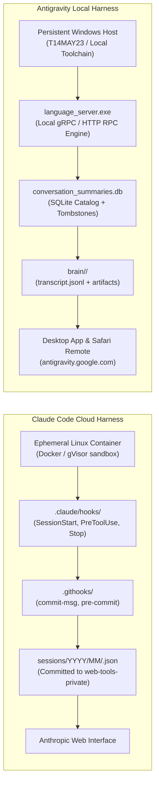

# Harness Comparison: Claude Cloud vs. Antigravity Local

A structural comparison of the estate's two primary execution environments,
defining what a harness is and how each runtime scaffolds its model.
*(verified 2026-10-01)*

---

## 1. What Is "The Harness"?

In AI engineering, the **model** is the core cognitive engine (e.g. Claude 3.7
Sonnet, Gemini 2.5 Flash / 3.8 Flash). The **harness** is the operational scaffolding
wrapped around that engine:

* **Senses:** How files, repository maps, instructions, and messages enter the session.
* **Hands:** The tool runtime that executes bash commands, file edits, and searches.
* **Boundaries:** The safety guards, hooks, and commit gates that constrain actions.
* **Memory & State:** How transcripts, working files, and session artifacts persist.
* **Interface Bridge:** How the session connects to the user, whether through an IDE,
  a terminal, a web browser, or mobile remote control.

---

## 2. Architecture Comparison

---

## 3. Side-by-Side Matrix

| Dimension | Claude Code Cloud Harness | Antigravity Local Harness |
| :--- | :--- | :--- |
| **Host System** | Ephemeral Linux container (baked image, non-root user). | Persistent Windows workstation (`T14MAY23`). |
| **Shell & Tooling** | Linux `bash`, POSIX coreutils, pre-installed Chromium. | Windows PowerShell, Windows command line, native Git. |
| **Persistence** | Discarded on session stop; only git commits survive. | Full filesystem persistence; files and databases remain. |
| **Hook Lifecycle** | Lifecycle hooks in `.claude/hooks/` triggered by events. | Native application rules, skills, and configuration files. |
| **Session Capture** | Whole-session JSON exported to `web-tools-private`. | Local SQLite index + JSONL transcript in `brain/<uuid>/`. |
| **Telemetry Format** | Monolithic JSON with turn history and tool inputs. | Multi-part: SQLite summaries, JSONL trajectory, artifact files. |
| **Remote Control** | Web chat via Anthropic cloud infrastructure. | Push sync via Google Cloud Hub (`daily-cloudcode-pa`). |
| **Attribution** | `Claude-Session: <url>` commit trailer; `claude/*` branch. | `Co-Authored-By: Gemini` trailer; `gemini/*` branch. |

---

## 4. Cross-Harness Continuity

Because both harnesses operate across the same repository collection under
`C:\Users\mehrl\Code\gh\`:

1. **Shared Standards:** Both harnesses obey the conventions in `CLAUDE.md`,
   `docs/QUALIFIED-WRITING.md`, and `docs/SURFACING.md`.
2. **Git Coordination:** Neither harness assumes the other's environment:
   * Claude sessions rely on `.claude/hooks/` and Linux toolchains.
   * Antigravity sessions execute native PowerShell and Windows scripts.
3. **Session Ingestion:** Antigravity transcripts can be normalized through
   `sessions/tools/import_antigravity.py` to enter `web-tools-private/sessions/`,
   allowing the Web Tools Activity view (`?view=sessions`) to index both harnesses
   under a unified timeline.
