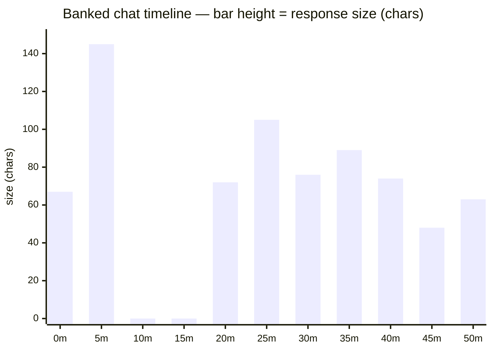
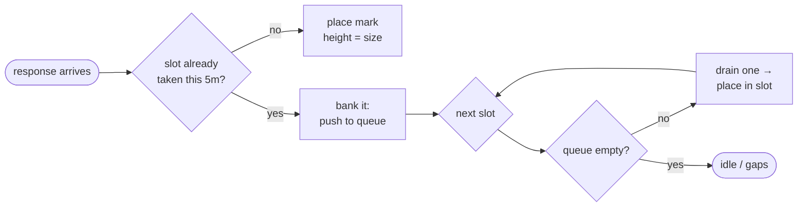

# markdown — what GitHub-flavored markdown can render

GitHub renders far more than paragraphs and lists. This page is a small gallery of
things that show up **when you view a `.md` on GitHub** — no JavaScript, no build step,
just static markdown that the renderer turns into pictures, charts, and callouts.

The running example throughout is an **imaginary chat dialog plotted on a timeline**:
each *response* is a mark whose **height is its size** (character count), time runs
left-to-right in **five-minute slots**, and an empty slot is a **gap**. When two
responses land in the same slot we **bank** the overflow — queue it and drain one per
slot into the slots that follow, so every response keeps its own mark.

---

## 1 · Unicode block sparklines

The most portable trick: the block glyphs `▁▂▃▄▅▆▇█` in a monospaced code fence make a
sparkline out of plain text. One glyph per five-minute slot, blanks for gaps. This
renders in *any* markdown viewer, GitHub or not.

```text
  ▄█    ▄▆▅▅▅▃▄
  0           50m      ← banked: the 20m burst of 4 drains forward into 25–45m
```

The payoff of banking is clearest beside the **raw** version, where collisions collapse
into one slot and the other responses are simply lost:

```text
  █     ▆▅  ▃ ▄
  0           50m      ← raw: slot 0 ate 2 responses, the 20m slot ate 4 — only the tallest shows
```

Scale maps smallest → largest response (max here = 145 chars).

---

## 2 · Mermaid charts

Fenced `mermaid` blocks are rendered as real diagrams by GitHub. The same timeline
as a bar chart — gaps are zero-height bars, banked responses are the ones pushed past
their arrival slot:



Mermaid also draws the banking *logic* as a flowchart:



---

## 3 · Tables

Pipe tables render as real tables, alignment and all. The slot-by-slot view of the
burst draining forward:

| slot | mark | response | size | status |
|-----:|:----:|:---------|-----:|:-------|
|   0m | ▄ | #1 | 67c | on-time |
|   5m | █ | #2 | 145c | **banked** (arrived 3m, slot 0 was taken) |
|  10m | · | — | — | gap |
|  15m | · | — | — | gap |
|  20m | ▄ | #3 | 72c | on-time |
|  25m | ▆ | #4 | 105c | **banked** (arrived 22m) |
|  30m | ▅ | #5 | 76c | **banked** (arrived 23m) |
|  35m | ▅ | #6 | 89c | **banked** (arrived 24m) |
|  40m | ▅ | #7 | 74c | **banked** (arrived 25m) |
|  45m | ▃ | #8 | 48c | **banked** (arrived 41m, still behind the burst) |
|  50m | ▄ | #9 | 63c | on-time |

---

## 4 · Alert callouts

GitHub turns `> [!NOTE]`-style blockquotes into colored callouts:

> [!NOTE]
> One mark per slot, height = size, blanks for gaps.

> [!TIP]
> If a slot is already taken, **bank the next response and drain it into the following
> slot** — repeat until the queue is empty. Nothing is dropped; the backlog spills right.

> [!WARNING]
> Turn banking *off* and collisions overwrite each other — the raw sparkline in §1 loses
> three of the nine responses.

---

## 5 · Collapsible details

`<details>` folds content behind a toggle — handy for tucking away the raw data:

<details>
<summary>The nine responses (arrival time · size)</summary>

| # | arrives | size | text |
|--:|:--------|-----:|:-----|
| 1 | 0m  | 67c  | Morning! Can you outline a plan for migrating our build to esbuild? |
| 2 | 3m  | 145c | Absolutely. At a high level: audit current loaders, map them to esbuild plugins… |
| 3 | 21m | 72c  | Yes — and the migration broke three things at once, replies stacking up. |
| 4 | 22m | 105c | First fix: the CSS import error. esbuild needs the css loader configured… |
| 5 | 23m | 76c  | Second: your dynamic imports need the splitting flag plus format set to esm. |
| 6 | 24m | 89c  | Third: the env-var replacement — use the define option, not a plugin… |
| 7 | 25m | 74c  | Bonus: drop the old terser step entirely, esbuild minifies on the way out. |
| 8 | 41m | 48c  | All four applied, build is green and ~6x faster. |
| 9 | 53m | 63c  | One straggler — sourcemaps are external now, was that intended? |

</details>

---

*Everything above is static markdown — open this file's source to see exactly what
produced each rendered piece.*
