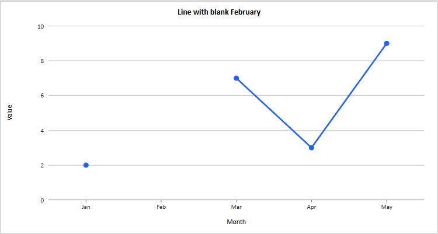
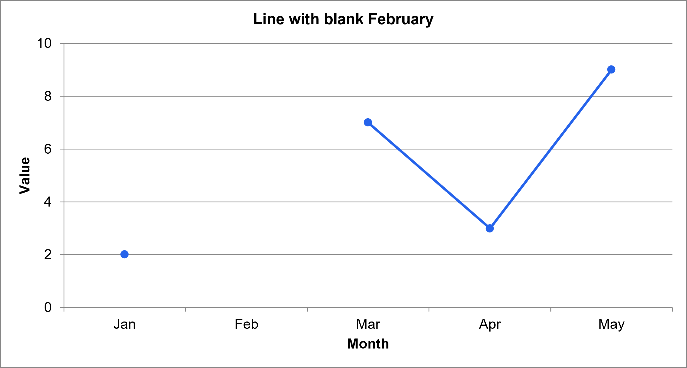
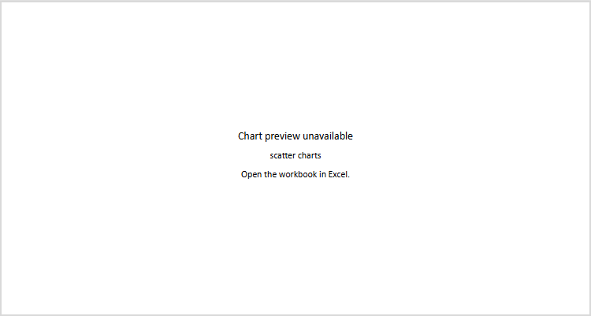
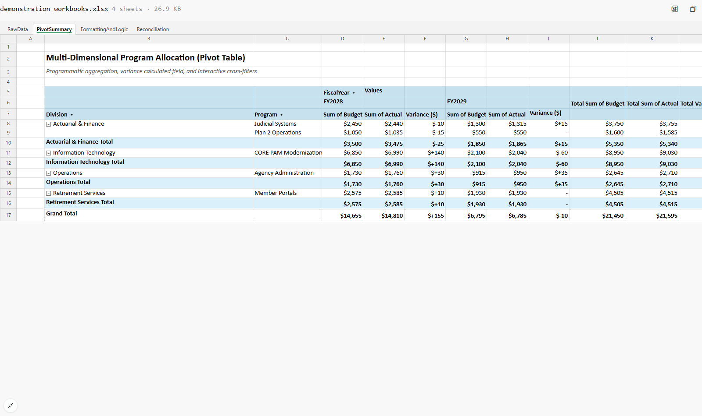
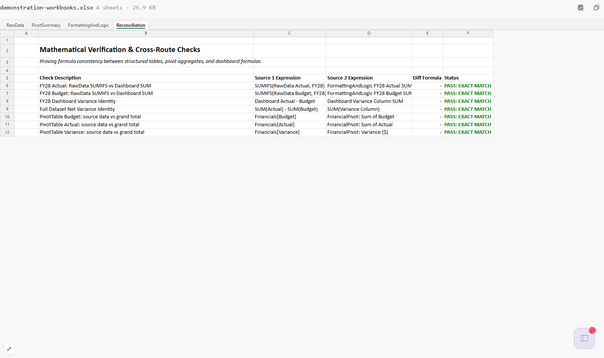

# Excel chart and PivotTable cleanup, September 25, 2026

This records the implementation follow-up to the native Excel experiments in
[PR 796](https://github.com/mehrlander/web-tools/pull/796) and the chart proposal
in [PR 792](https://github.com/mehrlander/web-tools/pull/792). The earlier research
archive remains unchanged. These are new results against the corrected branch.

The browser renderer remains our own SVG implementation. Excel is the reference
application for the specimens and the application that refreshed and saved the
repaired PivotTable. No native rendering service or automatic Excel screenshot
pipeline has been added to the app.

## What changed and why

| Observation in the original proposal | Correction | Evidence |
| --- | --- | --- |
| A blank worksheet cell was plotted as zero because its chart cache contained zero. | Resolve direct worksheet references after all sheets and shared strings are available. Preserve blanks as null. | Native line fixture: January 2, February blank, March 7, April 3, May 9. Browser shows four circular markers, with a gap at February. |
| Sparse cache points were compacted, shifting categories. | Allocate by `ptCount` and original point indices, retaining missing positions and trailing blanks. | Regression tests for sparse values and categories. |
| Explicit axis bounds and tick spacing were ignored. | Read and use `min`, `max`, `majorUnit`, orientation, number format, and axis titles. Clip marks to the plot area. | Native line fixture retains 0–10 in steps of 2 and the Month/Value titles. |
| Marker styles were invented from series order. | Read marker symbol/size, line width, and no-line style. Only an explicitly automatic marker uses a default sequence. | Native circles, size 6 points; marker-none regression. |
| Stacked charts were drawn as clustered charts; scatter charts vanished. | Preserve the drawing's anchor and show a visible unavailable notice for unsupported chart types or grouping. | Scatter screenshot; stacked and percentage-stacked regression tests. |
| Parsing was duplicated in two kits. | `xlsx.js` owns the chart model and source resolution; `xlsx-chart.js` renders it. | One parser and tests through the actual workbook analysis path. |
| The example PivotTable counted the table's totals row as another input record. | Use the `Financials` table as the source, then refresh and save in Excel. | Cache shrinks from 25 to 24 records; grand totals halve to the correct values. |
| Four “PASS” checks never inspected the PivotTable. | Add three `GETPIVOTDATA` comparisons against the source table. | Seven saved checks pass, including budget, actual, and variance PivotTable checks. |

Missing chart parts also retain an anchored notice. Direct source references
that cannot be resolved, worksheet errors, or formulas without saved results
are explicitly unavailable. Invalid or excessively dense tick intervals return
a notice rather than attempting an unbounded render.

## Native Excel repair

The original source was `RawData!B5:N30`. The `Financials` table spans that
range, but row 30 is its totals row. Its actual records are rows 6–29.
Including row 30 in the PivotTable source created a blank category and doubled
the grand totals: budget 42,900, actual 43,190, variance 290.

[repair-demonstration-pivot.py](../../../tools/build/repair-demonstration-pivot.py)
prepares a separate copy of the pre-cleanup workbook. It changes the source to
the table name, requests refresh on load, and adds reconciliation formulas with
no fabricated result caches. It preserves the other ZIP parts. It is deliberately
specific to this specimen, and refuses an already repaired input.

The prepared workbook was opened in the installed Windows Excel application
through computer use. Full calculation, Refresh All, and Save were invoked
through the UI. Excel's displayed Reconciliation!E6:F12 contained seven
“PASS: EXACT MATCH” results. The saved ZIP was then inspected independently:

| Check | Saved result |
| --- | --- |
| Pivot source | `worksheetSource name="Financials"` |
| Pivot cache records | 24 |
| Grand total budget, J17 | 21,450 |
| Grand total actual, K17 | 21,595 |
| Grand total variance, L17 | 145 |
| Reconciliation E10:E12 | 0, 0, 0 |
| Reconciliation F10:F12 | PASS: EXACT MATCH in all three |
| Saved worksheet error cells | 0 |

For example, E10 is
`ABS(SUM(Financials[Budget])-GETPIVOTDATA("Sum of Budget",PivotSummary!$B$5))`.
The status formula treats an error as FAIL. The corresponding actual and
variance checks use their own data fields. These checks deliberately compare
the full source with the unfiltered PivotTable; filtering the pivot may make
them fail until the filters are cleared and the pivot is refreshed.

The committed [demonstration workbook](../../examples/demonstration-workbooks.xlsx)
is Excel's saved result. Its SHA-256 is
`0e410ac0b7297b75970a4998531070c9633bcba3d9e01fb47c0cb87e7125fd7f`.
[demonstration-pivot.test.mjs](../../../tools/test/demonstration-pivot.test.mjs)
independently sums the source records and checks the saved pivot, cache,
reconciliation results, and absence of worksheet error cells.

## Browser results and download identity

[verify-excel-cleanup.mjs](../../../tools/test/verify-excel-cleanup.mjs) loads
the actual `pages/data-view.html` page through its `data-view/1` gzip envelope.
It exercises all nine sheets in the native chart, demonstration chart, and
repaired PivotTable workbooks. A fresh navigation between specimens prevents
the previous workbook from surviving a hash-only navigation.

The run used Edge 153.0.4234.48, 1600 × 950 CSS pixels, device scale 1. Local
dependency interception supplied the branch's code. No page errors or unmatched
external requests occurred. All four demonstration charts rendered; the native
line had the expected gaps, markers, ticks, and titles; scatter retained its
location with an explicit notice. All seven reconciliation statuses appeared
in the viewer.

The harness also downloads each specimen from a local HTTP attachment endpoint
and compares SHA-256 with the bytes supplied to the viewer. All three matched.
This tests transport identity; it does **not** claim a new workbook-download
control exists in the viewer, that the app recalculates a workbook, or that the
browser picture is pixel-identical to Excel. The downloaded bytes are identical
to the native specimen, so another native save would create a new artifact and
require a new hash.

The retained [verification.json](verification.json) records fixture hashes,
rendered semantics, browser version, and source hashes normalized to LF line
endings. Browser harness output is retained in the three `.log` files here.
[verify-chart-styles.mjs](../../../tools/test/verify-chart-styles.mjs) also passed
the four demo charts and mobile horizontal-scroll check.
[verify-table-styles.mjs](../../../tools/test/verify-table-styles.mjs) passed
the table and PivotTable styling checks against this branch's local workbook.
Both harnesses now accept `PLAYWRIGHT_CHANNEL` and `XLSX_PREVIEW_DIR`; they no
longer depend on a personal screenshot folder or a remote `main` workbook.





The native image above was exported during the September 24 reference run and
is reused unchanged. It is not a new September 25 Excel export. The fixture is
[native-chart-cases.xlsx](../../../tools/test/fixtures/native-chart-cases.xlsx),
SHA-256 `96e0742507ef118fe00639331ba4c6acb98fe42198acb45f7c60d42dbb951326`.







## Repeating the checks

With checkout dependencies installed, run:

```sh
node --test tools/test/xlsx-chart.test.mjs tools/test/demonstration-pivot.test.mjs tools/test/xlsx.test.mjs
node tools/test/verify-chart-styles.mjs
node tools/test/verify-table-styles.mjs
node tools/test/verify-excel-cleanup.mjs
npm run preflight
```

On a machine with Edge but no Playwright-managed Chromium, set
`PLAYWRIGHT_CHANNEL=msedge`. Set `XLSX_PREVIEW_DIR` to a writable output folder.
In the restricted Windows task environment, `TEMP` and `TMP` also needed a
task-owned writable directory. The scripts default to `tools/.preview/` when
no output directory is provided.

To repeat the native repair, obtain the original demonstration workbook from
PR 792 commit `3263a62ec6588e6e60df1afbf77697b3d1e9582c`, run the repair script
with separate input and output paths, and open the output in Excel. Refresh,
calculate, save, then run the fixture checks against the saved result. Merely
running the Python preparation script does not complete the repair.

## Remaining boundaries

These fixes establish tested semantics for a small subset; they do not certify
Excel rendering fidelity. The current renderer handles basic clustered
columns/bars, standard lines, and simple pie/doughnut presentations. Automatic
axis spacing and plot geometry remain approximations. Font metrics, theme
resolution, legend layout, data labels, category formatting, per-point styling,
and many chart options are not fully modeled. The native reference and browser
image visibly differ in typography and spacing.

Stacked/percentage-stacked, scatter, combination, date-axis, logarithmic-axis,
and multiple-value-axis charts are explicitly unavailable. Named, structured,
external, or otherwise unsupported chart source formulas are also unavailable
when direct source resolution is required. Formula results come from saved
workbook caches and may be stale; the browser has no calculation engine. This
is not a comprehensive feature detector: unsupported formatting options can
still be approximated or omitted on otherwise supported charts.

The next architectural project remains a native rendering worker with a clear
workbook identity, Excel environment record, render targets, output manifest,
and bounded job lifecycle. That would support an Excel-rendered preview tier.
It should remain distinct from the browser approximation and from the native
reference tests used to improve that approximation.
