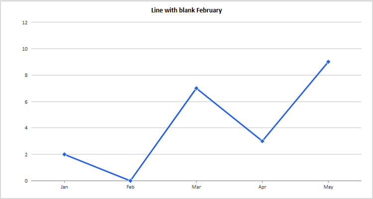

# Excel work: what landed and what remains

Assessment on September 25, 2026. The related conversation covered faithful workbook previews, our own browser chart renderer, using the installed Excel application as a reference, and retaining experiments so later agents can extend the work. We produced a working validation method and several tested examples. An unattended native rendering service and a general Excel-compatible browser renderer remain future work.

## GitHub state at this assessment

| Work | State | What it delivers |
| --- | --- | --- |
| [PR 791](https://github.com/mehrlander/web-tools/pull/791) | Merged September 24 | Table and PivotTable regions, cell roles, and browser styling |
| [PR 792](https://github.com/mehrlander/web-tools/pull/792) | Open, unmerged; conflicts with main | Proposed independent SVG rendering of column, bar, line, and pie charts |
| [PR 796](https://github.com/mehrlander/web-tools/pull/796) | Open, unmerged; updated with this assessment | Native Excel research, reusable validation skill source, workbooks, scripts, screenshots, and the subsequent PR 792 review |

The checked main revision is `f1db9653` and PR 792 remains at `3263a62ec6588e6e60df1afbf77697b3d1e9582c`, the revision reviewed. Main does not contain `lib/kits/xlsx-chart.js`. Publishing research to a PR makes it available on GitHub; it does not mean the research or renderer has merged. No renderer fixes or PR merges were performed as part of this assessment.

## What the experiments established

- **Actual Excel testing:** computer use opened the table/PivotTable specimen, inspected native objects and their source, and exported the controlled column, line, and scatter charts through Save as Picture. The [native workflow](../excel-validation-2026-09-24/source/technical/NATIVE-EXCEL-WORKFLOW.md) records the successful steps, failed capture attempts, and cleanup.
- **Workbook delivery:** the existing viewer's actual Raw action downloaded the inspected repository workbook. A separate local prototype displayed native Excel chart PNGs and downloaded their workbook; received bytes and SHA-256 hashes matched the retained artifacts. Its page-load hash guard is not an atomic guarantee for a later download request. The [technical guide](../excel-validation-2026-09-24/source/technical/README.md) distinguishes those tests.
- **Independent browser rendering:** the early viewer revision had no chart output. PR 792 renders the four demonstration charts, but its broader cases contain semantic errors. The [retained review](source/README.md) and [machine-readable probe](source/probe-results.json) document the differences.
- **A reusable skill:** all six files of the locally installed `validate-excel` skill match the [source preserved in PR 796](../excel-validation-2026-09-24/source/technical/skill/SKILL.md), byte for byte. The skill separates artifact identity, meaning, and appearance, and gives a process for controlled experiments. This publication preserves the skill; it does not add a marketplace distribution mechanism.
- **Creation routes:** the capability probe and prior-script research distinguish native Excel automation from file writers. XlsxWriter produced the controlled chart fixture. A limited Artifact Tool attempt and its limitations are retained. Discovery of COM registration, ImportExcel, or a Python package is recorded separately from successful execution. This conversation did not complete a comparative benchmark of PowerShell COM, Python COM, VBA, and file-only writers.

## Problems still outstanding

The demonstration workbook on checked main has SHA-256 `998d5483e1dee7db4c14c9f17142842f5eba451825b33afefa5fc11f4c82be14`, identical to the artifact tested in Excel. Its PivotTable source includes the table totals row. Budget 21,450 and actual 21,595 consequently become pivot grand totals 42,900 and 43,190. The four PASS formulas do not check that pivot. The underlying workbook problem therefore remains in the shipped example even though table/PivotTable rendering has merged.

PR 792's reviewed renderer turns a blank February into a connected zero point, compacts sparse cache indices, substitutes clustered bars for stacked groupings, discards explicit axis bounds, and picks markers by series position. Scatter charts are absent. Its existing XLSX unit file passed 87 tests; our additional probes exposed cases outside those tests. The exact browser review remains applicable to the unchanged PR head. It is not a fresh native Excel session or a certification of an eventual merge result.

The native-image prototype is a demonstrated route to a faithful preview, not a production rendering service. It still needs an owned Excel process or controlled interactive worker, a job protocol, and immutable publication of the workbook and its image under the same artifact identity. The computer-use export path worked; unattended export was not established by our run. Earlier author artifacts report COM exports, and are preserved below with their own provenance rather than being counted as a COM test by this task.

## What was local and is now preserved here

The audit compared 188 files across the task's outputs and relevant experiment directories against the already-published research. The useful original scripts, fixtures, native captures, and skill files were already present. The earlier research archive also already exists beside its repository directory. The standalone local skill ZIP duplicates the preserved skill source, and the inventory filename differences are documented in the original publication wrapper. Dependency caches, cloned repositories, and temporary replay directories are not additional research deliverables.

This run adds all 25 files from the subsequent local PR 792 review: detailed findings, parser/browser probe, logs, screenshots, SVGs, and native line reference. It also preserves the exact current PR demonstration workbook and six related author artifacts: four direct chart PNGs, the earlier workbook, and the earlier walkthrough. Those seven additional files make the review's comparison with earlier native references inspectable on GitHub. All 32 source files were copied without changing their bytes.

The earlier and current PR demonstration workbooks have different whole-file hashes. Their four chart XML parts are byte-identical. The author's walkthrough reports COM creation/export; the retained files support chart comparison but do not themselves reproduce that automation. No zero-byte failed image exports or unrelated files from that artifact directory were included.

## Read, compare, and verify

Native Excel's line chart:

The same workbook in PR 792's browser renderer:

The images have different native resolutions. These illustrations show semantic differences; no pixel similarity score or unrecorded image transformation is claimed.

- [Original research and reproduction instructions](../excel-validation-2026-09-24/README.md).
- [Detailed PR 792 review](source/README.md), [original probe](source/probe.mjs), and [results](source/probe-results.json).
- [Earlier author walkthrough](source/prior-gemini/walkthrough.md) and [reviewed PR workbook](source/pr792-demonstration-charts.xlsx).
- [File identities and provenance](source/evidence-manifest.json).

Run `python verify-evidence.py` from this directory. The read-only verifier checks all 32 source files, the earlier/current chart XML comparison, and the original fixture's identity in the adjacent research bundle. It does not launch Excel or a browser. The frozen probe retains the original local worktree and runtime assumptions; its reproduction section names the paths to adapt. The native fixture and earlier native evidence remain in the adjacent original bundle so the two runs can be read together.

The original review's status and reproduction statements describe its local run. This assessment is the publication wrapper and supersedes its statement that the review was only local. The older 103-file research inventory and original downloadable archive remain unchanged.

## Suggested order of further work

1. Review and merge the documentation independently of renderer changes so future exploration has durable evidence.
2. Correct the demonstration workbook's pivot source and make a reconciliation check compare pivot results with source data.
3. Address PR 792's demonstrated semantic failures and its main-branch conflicts. Unsupported chart features should have an explicit fallback until implemented.
4. Promote the controlled fixtures into browser regression cases. Check plotted values, gaps, axes, and geometry before spending effort on typography or pixel thresholds.
5. Develop the native rendering worker and immutable preview/download protocol. Keep the tested browser renderer for supported combinations and use native images when fidelity is not yet established.

The immediate foundation is already concrete: our own renderer under review, real Excel evidence to evaluate it, and a skill that explains how to extend the evidence one feature at a time.
