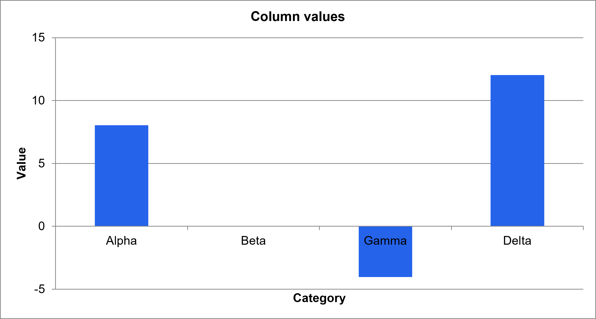
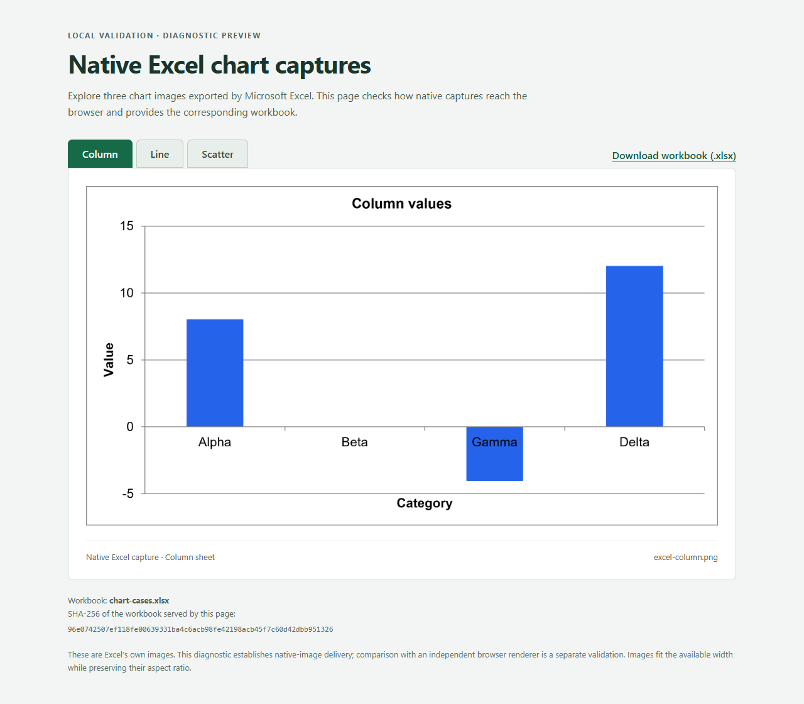

# Native Excel validation research, September 24, 2026

This research accompanies [PR 791](https://github.com/mehrlander/web-tools/pull/791). It records native Excel inspection, controlled chart creation and export, the browser viewer's behavior, actual workbook downloads, and a prototype that serves Excel-rendered chart images with their workbook.

The browser experiments used revision `5109699ac5eea3ca510947859ff9e5cb3980676e`. PR 791 subsequently merged with a different final head. These observations describe the tested revision and retained fixtures; they do not certify the later merge or current viewer.

The [September 25 assessment](../excel-chart-review-2026-09-25/README.md) explains what merged, what remains open, and where this conversation's useful local content is preserved. That separate run contains the subsequent PR 792 browser-chart review and its native references. The original evidence below remains frozen.

- [Technical findings](source/technical/README.md): claims, measurements, evidence, limitations, and next experiments.
- [Reproduction and script catalog](source/technical/REPRODUCTION.md): dependencies, script behavior, output paths, and repeatable checks.
- [Native Excel workflow](source/technical/NATIVE-EXCEL-WORKFLOW.md): the interactive application steps, capture failures, and cleanup procedure.
- [Complete downloadable research archive](../excel-validation-2026-09-24.zip): the original frozen bundle, including source snapshots and the reusable skill.
- [Evidence inventory](source/technical/evidence-manifest.json) and [source/script index](source/technical/script-index.json): file identities and provenance roles.

From this directory, verify the retained evidence with Python 3.9 or later:

```sh
python source/technical/verify-evidence.py
```

The verifier uses the standard library, reads files only, and checks 103 inventoried files plus selected workbook package facts. Run without Python's `-O` flag. The imported run is retained under `source/`, the repository convention for supplied material. The repository entry README and `.gitattributes` are publication wrappers outside the original inventory. The directory attributes preserve original line endings so checkout does not invalidate file hashes.

The original guides retain machine paths and local runtime details as historical evidence. The verifier resolves its bundle relative to its own file and works from this repository copy. Other experiment scripts may need the path adaptations described in the reproduction guide. Native Excel inspection and chart-image export were interactive; there is no tested unattended Excel worker in this bundle.

The evidence exposed two useful distinctions. The specimen's PivotTable includes the table totals row, doubling its grand totals, while its four reconciliation PASS formulas do not reference the pivot. The chart specimen has a genuinely blank line-series input whose stored chart cache is zero, while Excel displays a gap. The guide links the native captures and package facts for both findings.

## Native chart and browser evidence

Excel's exported column chart:



The separate native-image browser preview:



Displaying Excel's image validates image delivery and workbook identity for the captured run. It does not establish an independent browser renderer's fidelity. The prototype's workbook hash guard runs at page load; the guide documents the later-download request gap and the immutable-artifact approach proposed for future integration.

## Publication adaptation

The cached `claude-mark.js` is stored with a `.snapshot` suffix to distinguish historical source from another active logo implementation. Its bytes are unchanged. The repository script index and inventory reflect that filename; use each index entry's `originalTaskRelativePath` when restoring replay filenames. The downloadable archive preserves the entire original bundle, including its original filenames and metadata.
