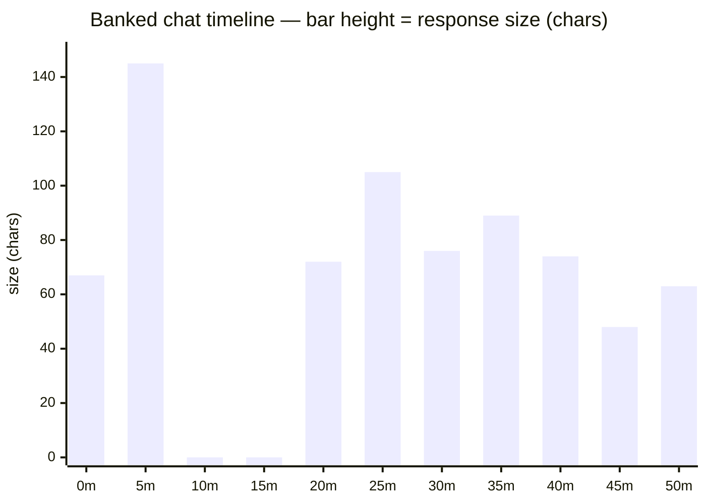

# Sparkline · Chat Timeline

An imaginary chat dialog laid out on a timeline, rendered **inside this markdown file** —
no JavaScript, just static glyphs and a Mermaid chart that GitHub renders on view.

Each *response* is one mark; its **height is the response size** (character count).
Time runs left-to-right in **five-minute slots**. A slot with no response is a **gap** —
blank, no mark. When two responses land in the same five-minute span we **bank** the
overflow: queue it and drain one per slot into the slots that follow, so every response
keeps its own mark, shown back-to-back until the queue empties.

---

## The sparkline (Unicode blocks)

Renders in any markdown viewer — it's just text in a monospaced code fence, one glyph per
five-minute slot, blanks for gaps.

```text
  ▄█    ▄▆▅▅▅▃▄
  0           50m      ← banked: the 20m burst of 4 drains forward into 25–45m
```

Compare **raw** (no banking) — collisions collapse into a single slot and the other
responses are simply lost:

```text
  █     ▆▅  ▃ ▄
  0           50m      ← raw: slot 0 ate 2 responses, slot 20m ate 4 — only the tallest shows
```

Block scale `▁▂▃▄▅▆▇█` maps smallest → largest response (max here = 145 chars).

---

## Same data as a Mermaid bar chart

GitHub (and any Mermaid-aware renderer) draws this as an actual chart. Gaps are
zero-height bars; banked responses are the ones pushed past their arrival slot.



---

## How the banking lands, slot by slot

The burst of four responses arriving 21–24m (all in the **20m** slot) banks forward so
each gets its own bar across 20m → 45m. Nothing is dropped; the backlog just spills right.

| slot | mark | response | size | status |
|-----:|:----:|:---------|-----:|:-------|
|   0m | ▄ | #1 | 67c | on-time |
|   5m | █ | #2 | 145c | **banked** (arrived 3m, slot 0 was taken) |
|  10m | · | — | — | gap |
|  15m | · | — | — | gap |
|  20m | ▄ | #3 | 72c | on-time |
|  25m | ▆ | #4 | 105c | **banked** (arrived 22m) |
|  30m | ▅ | #5 | 76c | **banked** (arrived 23m) |
|  35m | ▅ | #6 | 89c | **banked** (arrived 24m) |
|  40m | ▅ | #7 | 74c | **banked** (arrived 25m) |
|  45m | ▃ | #8 | 48c | **banked** (arrived 41m, still behind the burst) |
|  50m | ▄ | #9 | 63c | on-time |

---

## The rule, in one line

> One mark per slot, height = size, blanks for gaps; if a slot is already taken,
> **bank the next response and drain it into the following slot** — repeat until the
> queue is empty.

*(The interactive version of this — toggling banking on/off live, randomizing the dialog —*
*lives in [sparkline-chat-timeline.html](sparkline-chat-timeline.html). This `.md` is the*
*render-anywhere counterpart.)*
