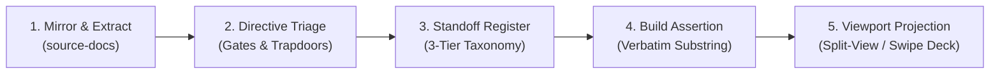

# Document Visual Mapping

Read alongside `source-anchoring` and `atomic-decomposition`.

## The premise

A complex reference document (a software manual, a regulatory instruction packet, an administrative code) presents two different problems at the same time:

1. **The Semantic Problem:** What does this text assert, require, or prohibit?
2. **The Topographical Problem:** Where does the reader's eye land, and where does the actor's hand click?

Conflating these two problems produces two failures:
* **The College-Student Highlighter Trap:** Highlighting continuous paragraphs or prominent styling without checking if the text carries binding authority. The result is visual noise that defeats attention.
* **The Abstract Checklist Trap:** Compiling an accurate list of obligations with no coordinates in the visual artifact. The reader still has to search through thirty pages manually to locate the relevant field or button.

Document content mapping (`atomic-decomposition`, `state-the-rule`) audits what a document means. Document visual mapping establishes where those audited units live on the page, transforming static reference material into a synchronized, interactive walkthrough.

## The goal and output

Produce an auditable standoff register (`.csv`) and a deterministic builder that together project a source document into an interactive reader (a DaisyUI/Alpine dual-pane viewer or a mobile swipe deck).

The register holds structured rows:
```csv
track,kind,title,note,file,page,anchor
```
Every anchor is an exact verbatim substring on the declared page, mechanically verified by a build script before any UI payload is generated.

## The process



### 1. Mirror and extract
1. Copy the source document to an immutable directory (`source-docs/`).
2. Extract the plain text per page (using form-feed `\x0c` page delimiters) into `_meta/extracted-text/`.
3. The extracted text is the deterministic ground for all string assertions.

### 2. Directive triage
Audit the extracted text for load-bearing operations before assigning any visual anchors. Filter for three specific categories:
* **Hard Gates and Locks:** Choices that are irreversible or freeze the record (for example, code identifiers that cannot be edited once saved; one-way submissions).
* **Blocking Requirements:** Required conditions that halt progress or fail an edit check (for example, balancing bars that must equal zero; mandatory statutory fee schedules).
* **System Trapdoors:** Expected behaviors that mimic bugs or confuse users (for example, empty-state notices like "No Records Found" before the first record; draft measures taking display priority over approved ones).

### 3. Standoff addressing via the 3-tier taxonomy
Map each identified directive to an exact string on the page. Never embed annotations in the source document or in UI markup.

Classify every anchor into one of three distinct functional levels:
* **Level 1 (Orientation Landmarks):** Bold section headers or screen titles that confirm the reader is on the correct page or screen (for example, `'Logging On'`, `'6. Submittal Recall & Resubmit'`).
* **Level 2 (Field & Decision Parameters):** Form labels, dropdown options, and input syntax constraints (for example, `'Budget Level:'`, `'Version Code: 2-8 Characters of choice, do not use I or O'`).
* **Level 3 (Surgical Payloads):** Specific action triggers, buttons, icons, or confirmation dialogs (for example, `'ABS displays “No Records Found”'`, `'Select the Packet icon under View/Prepare'`).

**Anti-pattern ban:** Never use dangling sentence fragments, trailing prepositions, or cut-off conditional clauses as anchors. An anchor must be a complete, self-contained semantic unit.

### 4. Mechanical build gate
Write an automated build step that loads the register, reads the extracted text file for each declared page, and asserts that the anchor string exists verbatim:
```python
# build assertion pattern
norm_page = " ".join(page_text.split())
norm_anchor = " ".join(anchor.split())
assert norm_anchor in norm_page, f"Broken anchor on page {page}: {anchor!r}"
```
If any anchor does not match the page text verbatim, the build script must abort with a nonzero exit code. This guarantees zero broken links or phantom highlights in the user interface.

### 5. Viewport projection
Serialize the validated register into a structured JSON payload (`data.js`). The presentation layer (such as a split-pane layout or swipe deck) renders each step as a card:
1. The user navigates to or taps a step card.
2. The document canvas scrolls to the designated page.
3. The UI highlights the bounding box of the anchor text.

## Key insights

* **Data before display:** Keep all document coordinates in the tabular register. The UI contains no hardcoded coordinates or page text.
* **Separation of concerns:** Content mapping decides what matters; visual mapping decides how to locate and operate it. Skipping content mapping causes the highlighter trap; skipping visual mapping causes the abstract checklist trap.
* **Mechanical truth:** The build script is the sole authority on anchor validity. A human editor chooses the semantic landmark; the compiler proves the string exists where claimed.

## Extending

This skill targets PDF reference manuals and administrative instruction packets rendered in dual-pane split-viewers and mobile swipe decks. It extends naturally to:
* Legal codes and statutes where citations bind directly to legislative bill drafts.
* Application UI walkthroughs where step cards bind to interactive software screenshots or live DOM selectors.
